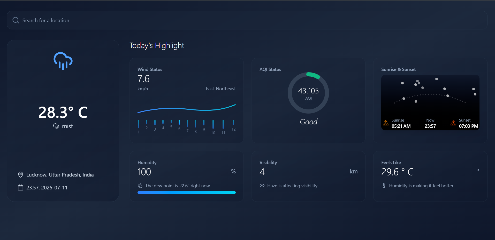

# 📄 Weather Web App — Documentation

> A full-stack weather application built with React.js (frontend), Express.js (backend), and WeatherAPI integration to display real-time weather highlights.

---

## 🚀 Project Overview

This weather application allows users to:

* Search for weather conditions of any city.
* View temperature, wind speed & direction, humidity, air quality, sunrise/sunset time, visibility, and more.
* Enjoy a clean UI with dynamic visuals and skeleton loaders.
* Experience real-time updates with proper loading states and error handling.

---

## 📦 Tech Stack

| Layer           | Tech Used                                 |
| --------------- | ----------------------------------------- |
| Frontend        | React.js, Tailwind CSS, Lucide Icons      |
| Backend         | Express.js, Node.js                       |
| API Integration | [WeatherAPI](https://www.weatherapi.com/) |
| Loader          | `react-spinners` (ScaleLoader)            |
| Deployment      | Frontend on Vercel, Backend on Render     |

---

## 🗂️ Project Structure

```
weather-app/
├── public/                 # Static files (e.g. favicon)
│   └── weathrrr.png
├── src/
│   ├── components/         # Reusable UI components
│   ├── services/           # Axios API functions
│   ├── assets/             # Icons, illustrations, etc.
│   ├── App.jsx             # Main app logic
│   └── main.jsx            # Entry point
├── .env                    # API key and environment config
├── server.js               # Express server (CORS proxy)
├── package.json            # Project metadata and dependencies
├── vite.config.js          # Vite configuration
└── README.md / DOCUMENTATION.md
```

---

## 🔑 Environment Variables

Create a `.env` file at the root:

```
WEATHER_API_KEY=your_weatherapi_key_here
VITE_API_BASE_URL=http://localhost:5000
```

> **Note**: Never push your `.env` file to GitHub.

---

## ⚙️ How it Works

### 🌤️ Weather Flow:

1. User enters a city in the `SearchBar`.
2. This triggers the `handleSearch(city)` function in `App.jsx`.
3. `fetchWeather(city)` sends a GET request to your Express server.
4. Express uses Axios to call **WeatherAPI**, passing the city.
5. Data is returned, processed, and shown via:

   * `WeatherCard`
   * `HighlightCard` (WindChart, AQIGauge, SunPath, etc.)

---

## 📁 Key Components

| Component       | Purpose                                        |
| --------------- | ---------------------------------------------- |
| `SearchBar`     | Accepts user input (city name)                 |
| `WeatherCard`   | Displays basic info: temp, location, time      |
| `HighlightCard` | Reusable card for wind, aqi, sunrise, etc.     |
| `SunPath`       | Animates sun's position from sunrise to sunset |
| `WindChart`     | Shows speed and direction of wind              |
| `AQIGauge`      | Displays air quality using a gauge             |
| `SkeletonCard`  | Used as placeholder before data is loaded      |
| `ErrorPage`     | Displays UI when weather data fails to load    |

---

## ↺ API Usage

**Endpoint:**

```
GET /api/weather?city=Delhi
```

**Backend Route:**
Located in `server.js`, proxying the request using your WeatherAPI key.

---

## 💡 Features Implemented

* [x] Real-time Weather Search
* [x] Responsive UI with Tailwind
* [x] Loader Spinner using `ScaleLoader`
* [x] Error page on API failure
* [x] Dummy Data / Skeleton UI before search
* [x] Light Backend to handle CORS

---

## 🧪 Testing Instructions

1. Clone the repo
   `git clone https://github.com/satyendragautam901/my_weather_web_app.git`

2. Install dependencies
   `npm install`

3. Create `.env` file with your API key.

4. Start backend server
   `node server.js`

5. Start frontend
   `npm run dev`

---

## 🌍 Deployment

| Platform     | Status                                    |
| ------------ | ----------------------------------------- |
| **Frontend** | Deployed on [Vercel](https://vercel.com/) |
| **Backend**  | Deployed on [Render](https://render.com/) |

**Environment-Specific API:**

* Automatically switches between local and deployed base URL using `VITE_API_BASE_URL`.

---

## 📸 Screenshots
[](https://my-weather-web-app-eta.vercel.app//)


---

## 🤋 About Me

I’m **Satyendra Gautam**, a Computer Science graduate passionate about:

* Building clean UI
* Backend APIs
* Sharing what I learn (via LinkedIn & Hashnode)

📌 Connect with me:

* [LinkedIn](https://www.linkedin.com/in/satyendragautam901)
* [GitHub](https://github.com/satyendragautam901)
